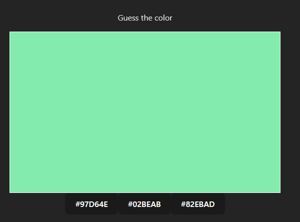
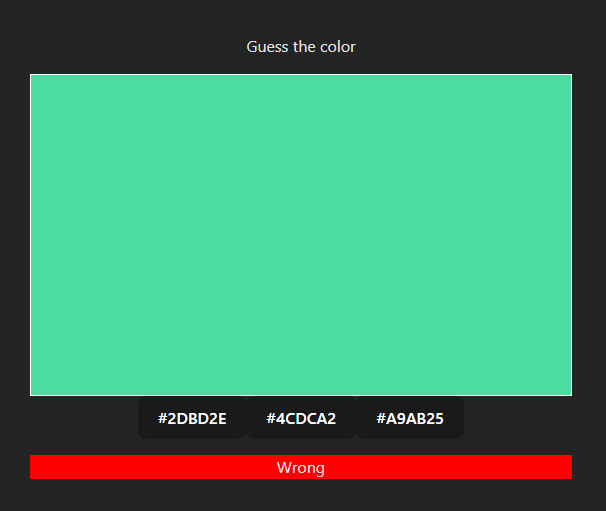
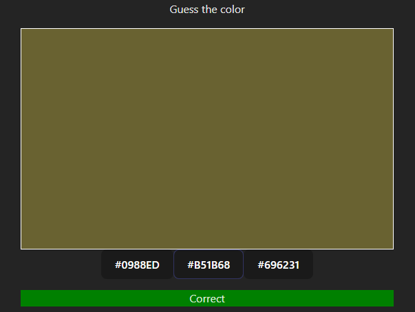

# Guess the color

Create a ReactJS application that will display a colour along with three possbile options. The user has to select one of the colour and if it is the right colour then the apllication will disply `correct`, otherwise it will display `incorrect`.

## Default state

## Incorrect state

## Correct state
